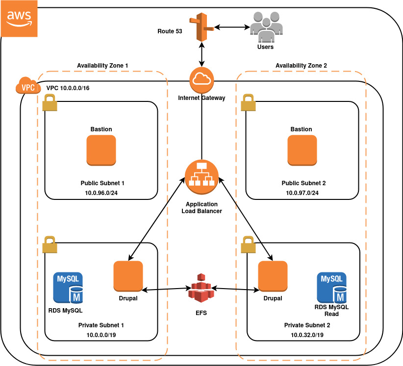

# AWS Terraform Project

Terraform project which creates a Drupal application on AWS.

## Details

Drupal is an open-source, content management platform written in the PHP server-side scripting language, and provides a backend framework for many enterprise websites and applications. Its tools help you build versatile, structured content for dynamic web experiences.

For use this code, please read those advices:

* Edit variable.tf with your data.
* Do not store AWS Credentials in this code.
* Edit main.tf with your local IP for Security Group Bastion Rules.
* Feel free to increase the number of instances and create autoscaling groups.
* I am using RDS Free-tier in this code. Feel free to modify that if you want Multi-AZ deployment.

## Topology

Here is what we create with this code (except Route 53):

## Requirements

| Name | Version |
|------|---------|
|  [terraform](#requirement\_terraform) | >= 0.12 |
|  [aws](#requirement\_aws) | >= 3.53 |
|  [random](#requirement\_random) | >= 3.1 |

## Usage

+ terraform init
+ terraform plan
+ terraform apply

## Author

This repo is maintained by [Natan Dias](https://www.linkedin.com/in/natan-dias).

